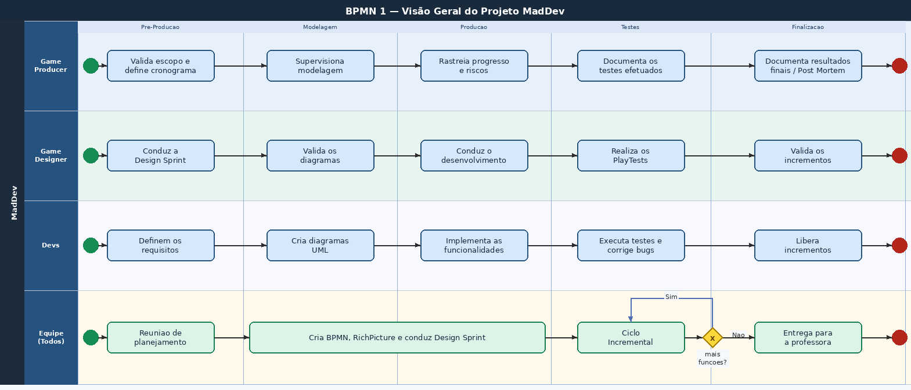
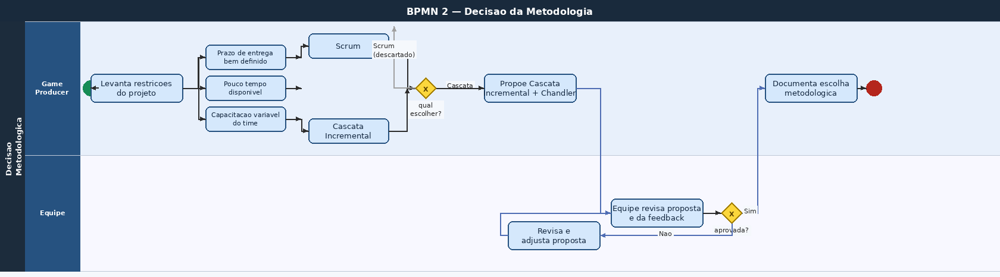
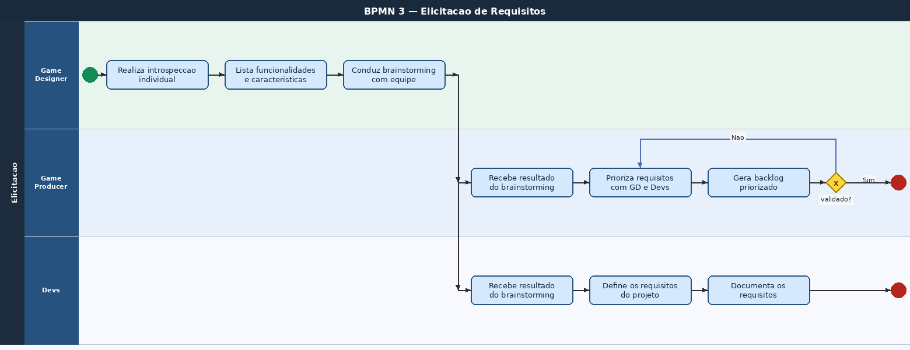
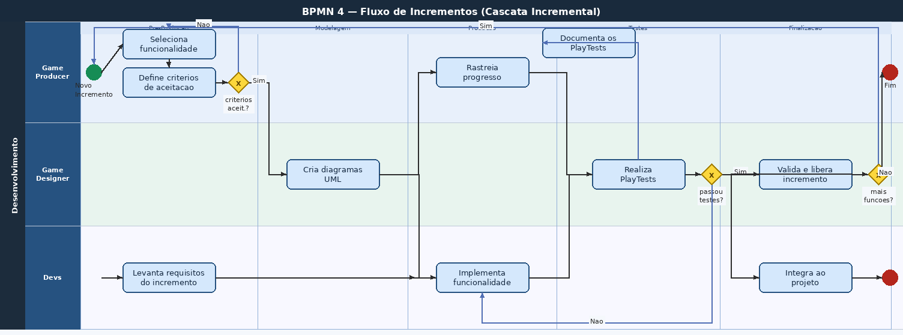

# 1.3. Módulo Modelagem BPMN

## O que é a Modelagem BPMN?
Trata-se de uma notação muito reconhecida na comunidade científica bem como no mercado, a qual é comumente utilizada para especificação de processos de desenvolvimento.
Essa notação, como perceberão com as vídeo-aulas, é muito rica e permite especificar atividades de vários tipos, retroalimentação (loops), temporalidade, participantes, dentre outros aspectos inerentes à documentação de um processo de desenvolvimento de software. 

## Visão Geral do Projeto - MadDev

## Decisão da Metodologia

## Elicitação de Requisitos

## Incrementos

## Referências
- Material de Apoio do Aprender3

## Histórico de Versionamento

| Nome                                        | Alteração                | Versão | Data       |
| ------------------------------------------- | ------------------------ | ------ | ---------- |
| [Mateus Vieira](https://github.com/matix0/) | Setup inicial do projeto | v0.1   | 30/03/2026 |
| Todos da Equipe                             | Primeira Versão do BPMN  | v1.0   | 04/04/2026 |